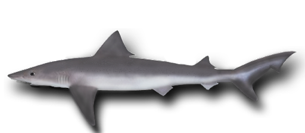

# Whaler Shark Model

R code and data required for whaler shark (<em>Carcharhinus brachyurus</em>) harvest model.

Supporting the following paper:

Bradshaw, CJA, TAA Prowse, M Drew, BM Gillanders, SC Donnellan, C Huveneers. 2018.
<a href="http://doi.org/10.1093/icesjms/fsy031">Predicting sustainable shark harvests when stock assessments are lacking</a>. <em>ICES Journal of Marine Science</em>. 75: 1591-1601

Professor <a href="https://scholar.google.com/citations?hl=en&user=1sO0O3wAAAAJ&view_op=list_works&sortby=pubdate">Corey J. A. Bradshaw</a> (<a href="mailto:corey.bradshaw@flinders.edu.au">e-mail</a>), <a href="https://globalecologyflinders.com/">Global Ecology</a>, <a href="https://www.flinders.edu.au/college-science-engineering">College of Science and Engineering</a>, <a href="http://www.flinders.edu.au">Flinders University</a>
 
February 2018

## Abstract

Effective fisheries management generally requires reliable data describing the target species’ life-history characteristics, the size of its harvested populations, and overall catch estimates, to set sustainable quotas and management regulations. However, stock assessments are often not available for long-lived marine species such as sharks, making predictions of the long-term population impacts of variable catch rates difficult. Fortunately, stage- or age-structured population models can assist if sufficient information exists to estimate survival and fertility rates. Using data collected from the bronze whaler (<em>Carcharhinus brachyurus</em>) fishery in South Australia as a case study, we estimated survival probabilities from life tables of harvested individuals, as well as calculated natural mortalities based on allometric predictions. Fertility data (litter size, proportion mature) from previous studies allowed us to build a fertility vector. Deterministic matrices built using estimates of life-table data or natural mortality (i.e. harvested-augmented and natural mortality) produced instantaneous rates of change of 0.006 and 0.025, respectively. Assuming an incrementing total catch at multiples of current rates, stochastic simulations suggest the relative rate of population decline starts to become precipitous around 25% beyond current harvest rates. This is supported by a sharp increase in weighted mean age of the population around 25% increase on current catches. If the catch is assumed to be proportional (i.e. a constant proportion of the previous year’s population size), the relative <em>r</em> declines approximately linearly with incrementing harvest beyond the current rate. A global sensitivity analysis based on a Latin-hypercube sampling design of seven parameters revealed that variation in the survival estimates derived from the life tables was by far the dominant (boosted-regression tree relative influence score = 91.14%) determinant of model performance (measured as variation in the long-term average rate of population change <em>r</em>). While current harvest rates therefore appear to be sustainable, we recommend that fisheries-management authorities attempt to sample a broader size range of individuals (especially older animals) and pursue stock assessments. Our models provide a framework for assessing the relative susceptibility of long-lived fishes to harvest pressure when detailed
stock data are missing.

## R code
<code>whalerSharkPopulationModel.GH.R</code>

## Data
- CD92.size.litter.csv
- prop.mat.csv
- structure.csv
- Sx.lin.csv

## Source files
<code>matrixOperators.r</code>

